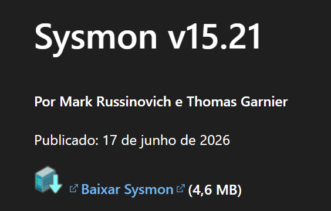
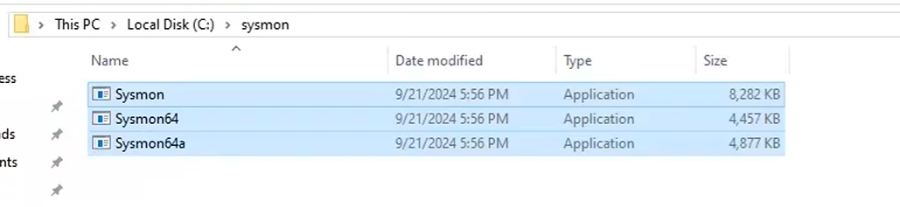
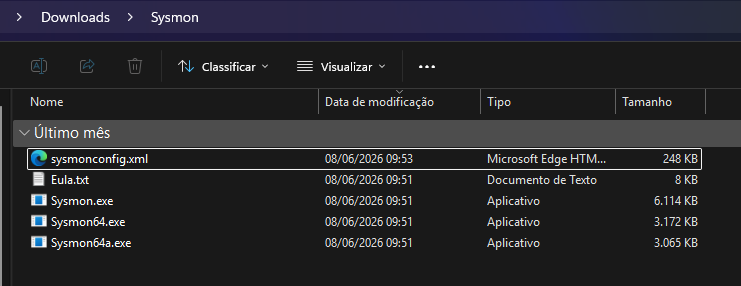
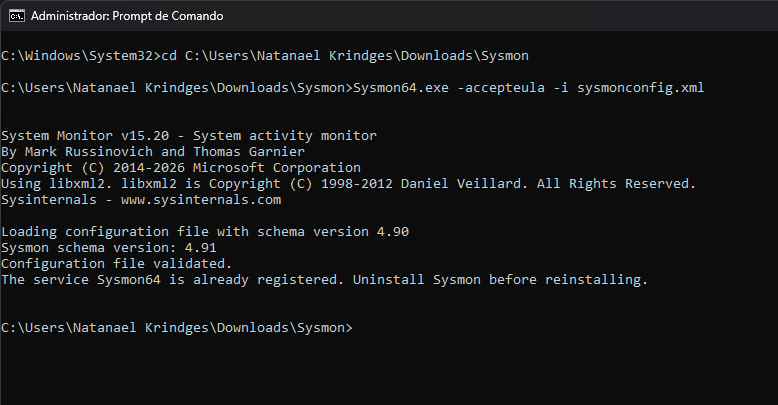
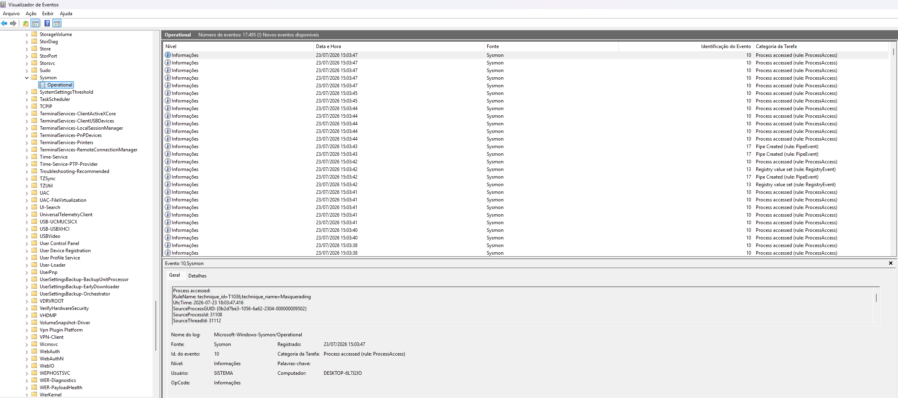
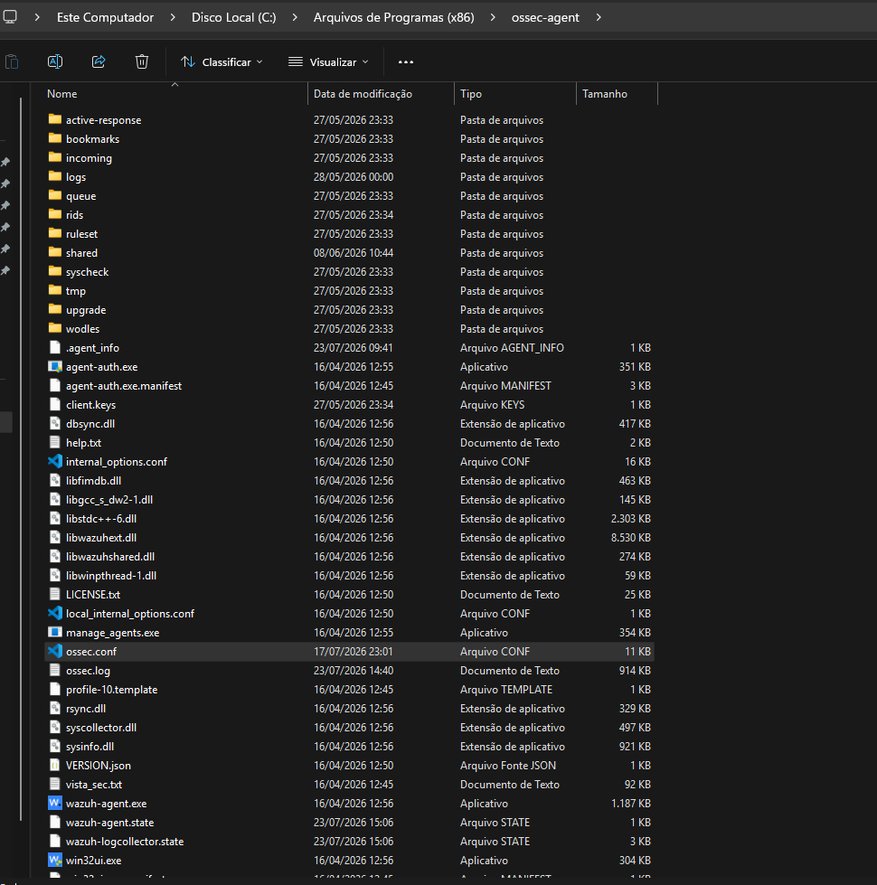
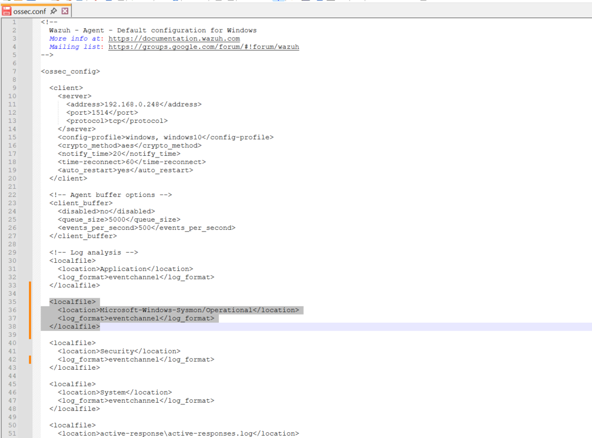

# Guia de Integração: Microsoft Sysmon + Wazuh

Documentação completa e passo a passo para instalação, integração e monitoramento de eventos do **Microsoft Sysmon** com a plataforma SIEM/XDR **Wazuh**.

---

## 🔗 Links de Referência
* **Artigo Oficial do Wazuh:** [Using Wazuh to monitor Sysmon events](https://wazuh.com/blog/using-wazuh-to-monitor-sysmon-events/)
* **Arquivo de Configuração Modular (sysmonconfig.xml):** [Olaf Hartong - Sysmon Modular GitHub](https://github.com/olafhartong/sysmon-modular/blob/master/sysmonconfig.xml)
* **Regras Customizadas Sysmon v5.0 para Wazuh:** [WAZUH_SYSMON_RULES](https://github.com/nks1097/WAZUH_SYSMON_RULES)
* **Video de Apoio** (https://www.youtube.com/watch?v=M2BzIk8eobI)

---

## 1. Visão Geral

O **Sysmon (System Monitor)** é uma ferramenta de monitoramento avançado da suíte *Microsoft Sysinternals* que roda como serviço no Windows. Ele registra informações detalhadas do sistema operacional (criação de processos, conexões de rede, alterações de registro, hash de arquivos, injeção de processos e consultas DNS) diretamente no *Windows Event Log*.

A integração do Sysmon com o **Wazuh** permite centralizar toda essa telemetria de segurança no SIEM, habilitando:
* Correlação avançada de eventos em tempo real.
* Mapeamento direto com o framework **MITRE ATT&CK**.
* Detecção de malwares, ransomware, movimentação lateral e bypass de segurança (AMSI/UAC).

---

## 2. Pré-requisitos

* **Sistema Operacional:** Windows 7 / Windows Server 2008 ou superior no endpoint.
* **Agente Wazuh:** Instalado e conectado ao servidor Wazuh Manager.
* **Permissões:** Acesso de Administrador (Local Admin) no endpoint Windows.

---

## 3. Passo 1: Download e Instalação do Sysmon

### 3.1. Download do Sysmon
1. Baixe o pacote do Sysmon no site oficial da Microsoft Sysinternals. https://learn.microsoft.com/pt-br/sysinternals/downloads/sysmon
   
   
   
3. Extraia o arquivo ZIP em uma pasta dedicada no seu endpoint (Exemplo: `C:\Sysmon` ou na pasta de `Downloads\Sysmon`).
   
   

### 3.2. Obtenção do Arquivo de Configuração (`sysmonconfig.xml`)
Para que o Sysmon capture apenas eventos relevantes e evite excesso de logs insignificantes, utilize um arquivo de configuração XML otimizado (como a versão de Olaf Hartong inclusa neste repositório ou SwiftOnSecurity).

1. Baixe o arquivo `sysmonconfig.xml` e salve-o na mesma pasta dos executáveis do Sysmon. https://github.com/olafhartong/sysmon-modular/blob/master/sysmonconfig.xml

   

### 3.3. Instalação via Prompt de Comando (CMD)
1. Abra o **Prompt de Comando (CMD)** como **Administrador**.
2. Navegue até o diretório onde o Sysmon foi extraído:
   ```cmd
   cd C:\Users\Natanael Krindges\Downloads\Sysmon
   ```
3. Execute o comando para instalar o Sysmon de 64 bits aceitando a EULA e carregando o arquivo de regras:
   ```cmd
   Sysmon64.exe -accepteula -i sysmonconfig.xml
   ```
   *(Nota: Caso precise atualizar as regras futuramente, utilize o parâmetro `-c`: `Sysmon64.exe -c sysmonconfig.xml`).*

  

---

## 4. Passo 2: Validação Local dos Logs no Windows

1. Pressione `Win + R`, digite `eventvwr.msc` e pressione **Enter** para abrir o **Visualizador de Eventos**.
2. No menu lateral esquerdo, navegue até:
   > **Aplicações e Logs de Serviços** ➔ **Microsoft** ➔ **Windows** ➔ **Sysmon** ➔ **Operational**
3. Confirme se os eventos do Sysmon (ex: Event ID 1 - Process Creation, Event ID 10 - ProcessAccess, Event ID 13 - RegistryValue, Event ID 17 - Pipe Created) estão sendo gerados normalmente.

  

---

## 5. Passo 3: Configuração do Agente Wazuh (`ossec.conf`)

Para enviar os logs coletados pelo Sysmon do endpoint Windows para o Wazuh Manager, é necessário editar o arquivo de configuração do agente.

1. No endpoint Windows, navegue até a pasta de instalação do agente Wazuh:
   ```text
   C:\Program Files (x86)\ossec-agent\
   ```

  

2. Abra o arquivo `ossec.conf` com um editor de texto (como Notepad++ ou Bloco de Notas) **executado como Administrador**.
3. Localize a seção de logs (`<localfile>`) e adicione o bloco abaixo para coletar o canal do Sysmon:

   ```xml
   <!-- Coleta de Logs do Sysmon -->
   <localfile>
     <location>Microsoft-Windows-Sysmon/Operational</location>
     <log_format>eventchannel</log_format>
   </localfile>
   ```

  

4. Salve o arquivo `ossec.conf`.

### Reiniciando o Agente Wazuh
* **Via Interface Gráfica:** Abra a janela do *Wazuh Agent*, clique na aba **Manage** ➔ **Restart**.
* **Via PowerShell / CMD (Administrador):**
  ```cmd
  net stop wazuh-agent
  net start wazuh-agent
  ```

---

## 6. Passo 4: Regras Customizadas no Wazuh Manager

Por padrão, o Wazuh possui um decodificador e regras base para o Sysmon. No entanto, alguns eventos (como o Event ID 22 - DNS Query) vêm com nível de alerta 0 (informativo) para economizar armazenamento, não aparecendo no dashboard por padrão.

Caso queira forçar a exibição ou criar alertas customizados:

1. Acesse o **Wazuh Dashboard**.
2. Vá em **Management** ➔ **Rules** ➔ **Custom Rules** (ou edite diretamente o arquivo `/var/ossec/etc/rules/local_rules.xml` no servidor do Wazuh Manager).
3. Adicione a regra personalizada abaixo (exemplo para capturar Event ID 22 com nível de alerta 3):

   ```xml
   <group name="sysmon,event_22,">
     <rule id="100001" level="3">
       <if_sid>61600</if_sid>
       <field name="win.system.eventID">^22$</field>
       <description>Sysmon - Event 22: DNS Query to $(win.eventdata.queryName) by $(win.eventdata.image)</description>
     </rule>
   </group>
   ```
4. Salve e reinicie o Wazuh Manager (`systemctl restart wazuh-manager`).

*(Dica: Para um conjunto completo e avançado de regras Sysmon para SOC, consulte nosso repositório exclusivo: [WAZUH_SYSMON_RULES](https://github.com/nks1097/WAZUH_SYSMON_RULES)).*

---

## 7. Passo 5: Validação no Wazuh Dashboard

1. Acesse a interface web do **Wazuh Dashboard**.
2. Navegue até a aba **Discover** ou **Security Events**.
3. Aplique os filtros pelo nome do seu agente ou pelo canal do Sysmon:
   ```text
   agent.name: "NOME-DO-SEU-COMPUTADOR"
   data.win.system.channel: "Microsoft-Windows-Sysmon/Operational"
   ```
4. Execute ações de teste no endpoint Windows (ex: abrir um terminal, executar `ping x.com.br` ou `net user`).
5. Confirme se os alertas detalhados contendo `commandLine`, `hashes`, `parentImage` e `destinationIp` estão sendo exibidos no painel em tempo real!
